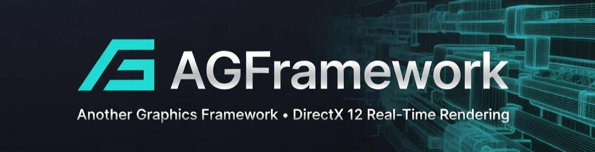
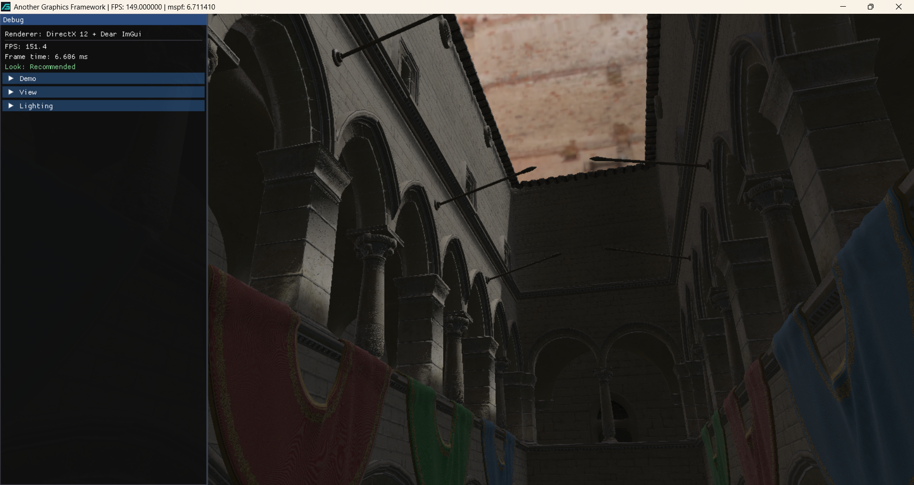
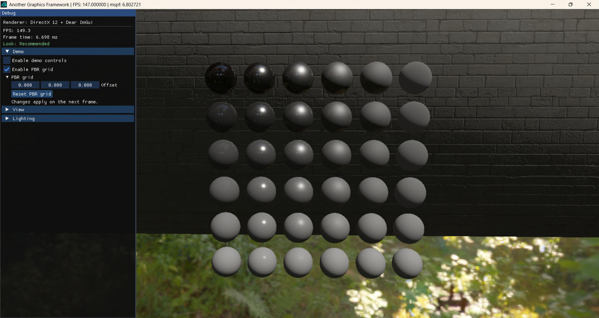
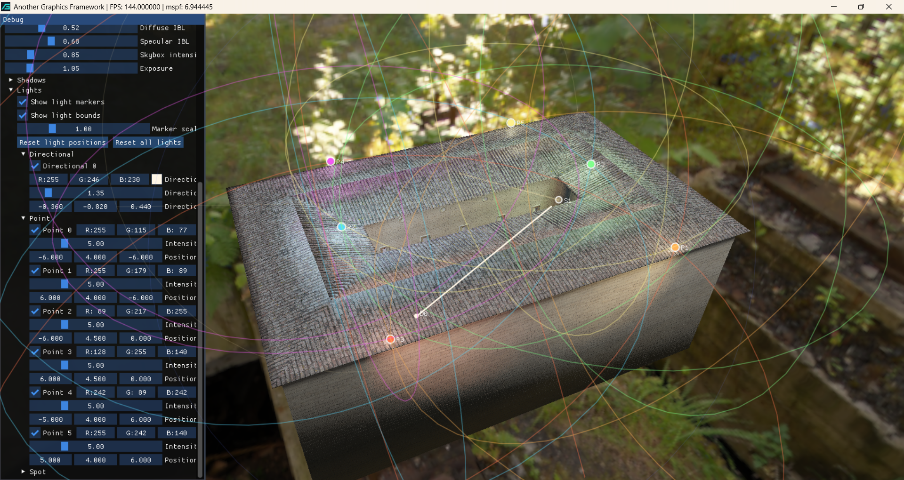

**A DirectX 12 rendering framework** for experimenting with modern real-time rendering techniques and graphics architecture on Windows.

## Screenshots

## Goal

AGFramework is organized as a small rendering framework rather than a full game engine. Its current architecture aims to keep rendering responsibilities separated into practical modules while staying simple enough to evolve incrementally.

## Architectural Style

The framework does not follow one strict high-level pattern such as MVC or ECS. Instead, it currently uses a combination of:
- layered architecture
- subsystem decomposition
- facade-style entry points
- composition over inheritance